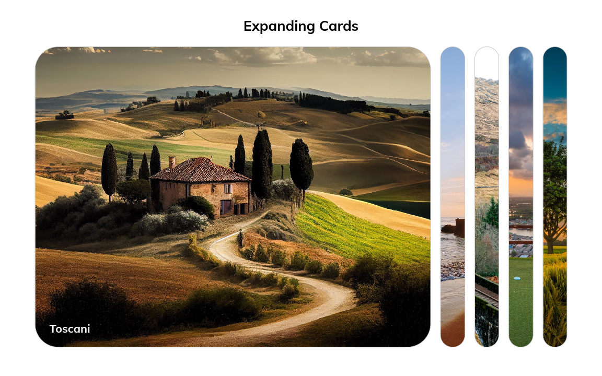

# Expanding Cards App

First exercise of the course "50 Projects in 50 Days" by Brad Traversy and Florin pop from [Udemy](https://www.udemy.com/course/50-projects-50-days/) but developed with **Vue.js**, and not with pure HTML, CSS and JavaScript.

The project was developed entirely in a single SFC (App.vue) that contains all the necessary code in only 123 lines of code, adding small additional details to the styles.

## Screenshot




## Demo & Repo

[Demo](https://expanding-cards-vue.netlify.app/)

[GitHub](https://github.com/drfcozapata/expanding-cards-vue)

## Project Setup

```sh
yarn
```

### Compile and Hot-Reload for Development

```sh
yarn dev
```

### Compile and Minify for Production

```sh
yarn build
```
