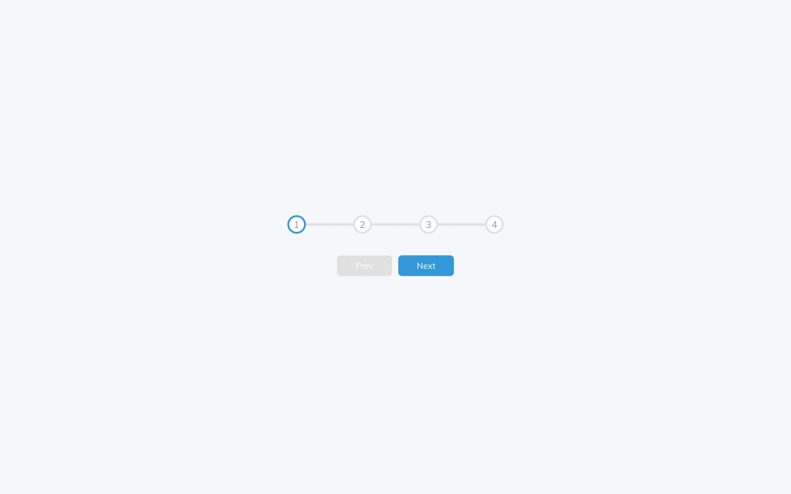

# Progress Steps App

The second exercise of the course "50 Projects in 50 Days" by Brad Traversy and Florin pop from [Udemy](https://www.udemy.com/course/50-projects-50-days/) but developed with **Vue.js**, and not with pure HTML, CSS and JavaScript.

## Screenshot



## Demo & Repo

[Demo](https://progress-steps-vue.netlify.app/)

[GitHub](https://github.com/drfcozapata/progress-steps-vue)

## Project Setup

```sh
yarn
```

### Compile and Hot-Reload for Development

```sh
yarn dev
```

### Compile and Minify for Production

```sh
yarn build
```
